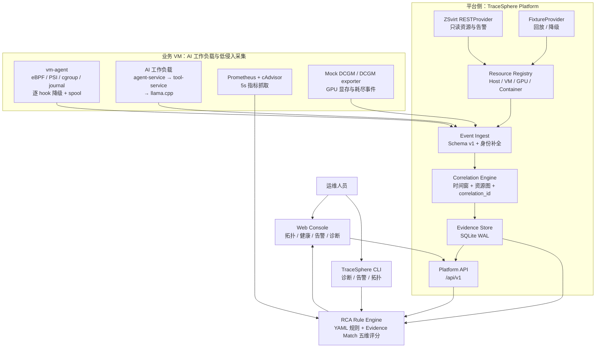
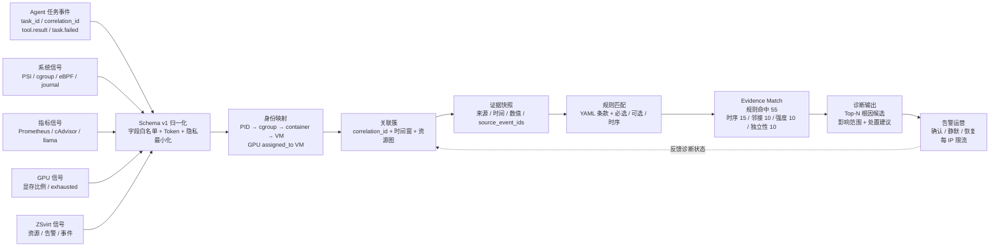
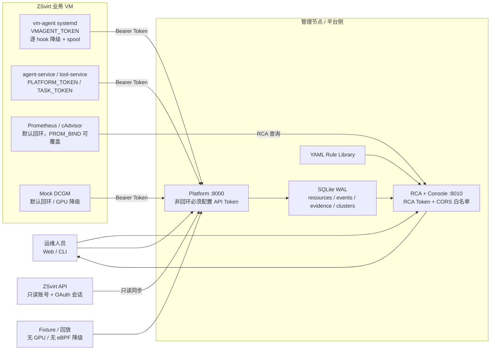

# TraceSphere 作品介绍

*面向 ZSvirt 虚拟机内容器与智能体工作负载的全栈可观测与根因诊断平台*

---

## 📋 项目定位

TraceSphere 面向智算云中的虚拟机内 AI 工作负载。它把 ZSvirt 的基础设施资源、虚拟机内的容器与进程信号、模型服务指标、Agent 任务事件和 GPU 显存信号放进同一条可追溯证据链，回答一个实际运维问题：

> 一次 Agent 任务失败，究竟来自应用、工具服务、容器、虚拟机、GPU，还是宿主机资源？

项目以三个原则组织系统：

| 原则 | 设计含义 |
|---|---|
| 虚拟机为边界 | 以 ZSvirt VM 作为基础设施和工作负载的连接点 |
| 工作负载为对象 | 对容器、服务、任务、模型推理和 GPU 使用建立可查询身份 |
| 事件关联为核心 | 用 `resource_id`、`correlation_id`、`task_id` 和时间窗建立证据关系 |

项目名称、组件名称和运行入口均统一为 **TraceSphere**；外层历史方案稿仅作为过程记录，现行口径以本文件、[README](README.md) 和 [方案说明](方案说明.md) 为准。

## 🎯 背景与问题

AI 工作负载跨越多个运行层：宿主机、GPU/vGPU、虚拟机、容器、模型服务和 Agent 任务。故障却经常发生在云平台资源视角之外，例如：

- 容器达到 memory limit 后被 OOM kill，工具调用随之失败
- 同一 VM 内的 CPU 争抢让模型推理延迟升高，Agent 任务超时
- 工具代理不可达，应用层只看到 `tool.result` 错误
- GPU 显存接近上限，模型服务或 Agent 任务受到影响

单独查看 ZSvirt、Prometheus、容器日志或应用日志，很难判断这些信号是否属于同一次故障。TraceSphere 将“资源身份、运行时信号、应用事件、关联簇和诊断建议”组织成一个统一的运维视图。

## 🏗️ 总体技术架构

系统分为三条边界清晰的数据路径：ZSvirt 基础设施同步、业务 VM 内信号采集、平台侧关联与诊断。Platform 负责归一化、资源图、关联和证据存储；RCA 只消费结构化上下文并执行 YAML 规则；Console 和 CLI 负责呈现结果。



*图 1：从 ZSvirt 和业务 VM 到 Platform、RCA、Console 的分层架构。*

<details>
<summary><strong>📐 图 1 的 Mermaid 源码</strong></summary>



</details>

---

### 关键组件

| 组件 | 主要职责 | 技术实现 |
|---|---|---|
| `platform` | ZSvirt 同步、资源图、事件归一化、关联簇和证据存储 | Python、SQLite WAL、REST/Fixture 双 Provider |
| `vm-agent` | VM 内内核和资源信号采集 | Go、cilium/ebpf、PSI、cgroup v2、journal |
| `workload` | 可复现的 AI Agent 业务链路和故障注入 | Docker Compose、llama.cpp、Toxiproxy、Prometheus、cAdvisor |
| `rca` | 规则驱动根因诊断和 CLI/API | Go、YAML Rule Engine、Evidence Match |
| `console` | 拓扑、健康、告警详情、诊断和指标曲线 | React、TypeScript、G6、ECharts、Ant Design |

## 🔗 数据模型与证据链

### 资源关系

TraceSphere 使用 `<kind>:<key>` 形式的资源标识，核心关系为：

```text
Host ──contains──> VM ──contains──> Container
GPU ──assigned_to──> VM
Container ──runs_on──> Service ──runs_on──> Task
```

应用事件通过 `correlation_id` 和 `task_id` 连接一次 Agent 任务；系统事件通过容器身份、VM 归属和时间窗加入同一个关联簇。最近的工程修复增加了 PID 到 cgroup、container ID 和 VM UUID 的身份映射，使 eBPF OOM、进程和网络事件能够落到具体资源上。

### Schema v1

统一事件字段包括：

```text
schema_version / origin / mode / observed_at / ingested_at / type /
event_type / resource_id / correlation_id / task_id / severity /
source / cluster_id / payload
```

事件入库后会经过字段白名单、身份补全、去重和时间归一化。业务文本不进入事件正文，Agent 侧只保留问题、回答和结果的长度等结构化元数据。

### 采集面与降级路径

| 信号 | 采集方式 | 频率 / 行为 |
|---|---|---|
| ZSvirt 资源与告警 | REST 只读同步 | 启动同步；`ZSVIRT_SYNC_INTERVAL` 默认 120 秒 |
| 容器内存与 CPU | cgroup v2 | 15 秒直报 |
| VM 压力 | `/proc/pressure/*` | 5 秒采样 |
| 进程、OOM、TCP 重传 | eBPF tracepoint | 实时；逐 hook 失败独立降级 |
| 内核 OOM | journal 模式匹配 | 轮询并去重 |
| Agent 任务、工具和推理 | AppEvent | 实时直报 |
| 容器和模型指标 | Prometheus / cAdvisor / llama.cpp | 5 秒抓取 |
| GPU 显存 | Mock DCGM 或真实 DCGM exporter | 15 秒上报 |

无 GPU 时使用 Mock DCGM；eBPF 不可用时保留 PSI、cgroup 和 journal；平台暂时不可达时，vm-agent 将事件写入 spool 并重试，FixtureProvider 可离线回放真实演练数据。

## 🔍 诊断闭环

TraceSphere 不直接输出不可解释的“猜测”，而是把规则命中、时间先后、资源邻接、信号强度和独立证据数量拆成五个评分维度。



*图 2：多信号归一化、身份映射、关联簇、证据快照和 RCA 输出的完整闭环。*

<details>
<summary><strong>📐 图 2 的 Mermaid 源码</strong></summary>



</details>

---

### Evidence Match 五维评分

| 维度 | 上限 | 含义 |
|---|---:|---|
| 规则证据命中 | 55 | YAML 条款命中情况，支持必选、可选、阈值和增量 |
| 时间优先性 | 15 | 根因信号是否先于业务失败出现 |
| 资源邻接度 | 10 | 同一资源、同一 VM 或资源图邻接关系 |
| 信号强度 | 10 | 严重度、阈值超出程度和增量强度 |
| 独立证据数 | 10 | cgroup、eBPF、指标、应用事件等来源的独立性 |

页面和 CLI 会同时展示证据 ID、来源、时间、数值、受影响资源和建议动作。评分用于解释证据命中程度，**不是概率，也不代表通用准确率**。

## 🧪 应用场景与真实验收

最近一次真实数据源验收使用 `platform=real`、`prometheus=real`、`fixture=off`。验收目录沿用历史批次名称，但证据文件时间窗为 2026-09-30；下表只使用该次整改后的结果。

| 场景 | 故障注入 | 关键跨层证据 | Top-1 结果 |
|---|---|---|---:|
| Case 1：容器 OOM | 收紧 `tool-service` memory limit | `memory.events.oom_kill`、`oom.ebpf`、容器重启、`task.failed` | 容器内存耗尽，99/100 |
| Case 2：CPU 争抢 | `cpu-stress` + 收紧模型服务 CPU 配额 | PSI `cpu.some`、CPU throttling、推理延迟、任务失败 | CPU 资源争抢，85/100 |
| Case 3：工具调用失败 | 关闭或延迟 Toxiproxy 工具代理 | `tool.result` 错误、`task.failed`、工具端点上下文 | Agent 工具调用失败，67/100 |
| Case 4：GPU 显存耗尽 | Mock DCGM 注入 `exhaust` 模式 | 显存使用率超过 90%、`gpu.memory.exhausted` | GPU 显存耗尽，89/100 |

Case 4 是没有特定 GPU 硬件时的降级演示。它使用与真实 DCGM exporter 相同的指标语义和规则接口；替换数据源后，资源关联和 RCA 规则不需要重写。

## 🛡️ 安全、隐私与可复现



*图 3：管理节点、业务 VM、ZSvirt API 和工作负载控制面的安全边界。*

<details>
<summary><strong>📐 图 3 的 Mermaid 源码</strong></summary>



</details>

---

### 访问控制

- Platform 使用 `TRACESPHERE_API_TOKEN`；非回环绑定且未配置 Token 时拒绝启动
- RCA 使用 `TRACESPHERE_RCA_TOKEN`，除健康检查外的 API 请求需要 Bearer Token
- vm-agent、Agent service、Mock DCGM 上报链路均通过环境变量注入 Bearer Token
- Platform 和 RCA 写接口按客户端 IP 做分钟级限流，默认上限为 600 次
- Prometheus、cAdvisor、llama、Toxiproxy、Mock DCGM 和 Agent `/task` 默认绑定回环；跨机指标读取使用显式 `PROM_BIND`
- ZSvirt 侧只使用只读账号，不调用资源写接口

### 隐私最小化

系统不上传 Agent 问题、模型回答或工具结果正文，只保留长度等诊断所需元数据。内核日志只做 OOM 模式匹配后上报结构化字段，事件入库使用字段白名单。提交包对地址、UUID、用户名、口令和证据副本统一脱敏，并执行残留扫描。

## 💡 创新点

### 跨层资源图与证据链

TraceSphere 的核心不是单一指标采集器，而是将 `Host → VM → GPU → Container → Service → Task` 作为统一资源图。应用事件通过任务锚点进入，系统事件通过身份映射进入，诊断结果可以回指原始事件和具体资源。

### 可解释的规则驱动 RCA

RCA 规则使用 YAML 描述信号、权重、阈值、关联约束和处置建议。新增规则不需要改动引擎代码。五维 Evidence Match 将“为什么这样判断”拆成可以复核的评分明细，适合运维人员定位和复盘。

### 真实采集与降级回放双轨

真实 ZSvirt、Prometheus、vm-agent 和 Agent 事件可落盘为 fixture；无 GPU 时用 Mock DCGM，无 eBPF 时保留 PSI/cgroup/journal。真实现场和离线演示共享数据契约，降低评审环境差异带来的复现风险。

### 低侵入探针与失败自愈

vm-agent 是单二进制 systemd 服务，按 hook 独立降级，上报失败写入 spool 并重试。已公开实测条件下，4 vCPU/4 GiB Ubuntu 24.04 VM 中，idle 平均 CPU 小于 1%、最大 RSS 11 MB；load 场景平均 CPU 小于 1%、最大 RSS 12 MB。该数据是指定环境下的测量结果，不作为所有内核和负载的性能保证。

## 📊 产品与交付形态

| 入口 | 适用对象 | 主要能力 |
|---|---|---|
| Web Console | SRE、平台运维、评审演示 | 拓扑、健康总览、告警详情、诊断建议、指标曲线 |
| CLI | 自动化脚本、现场排障 | `health`、`topo`、`alerts`、`diagnose`、fixture 回放 |
| Platform API | 采集器和上层服务 | 资源、事件、证据、关联簇、上下文聚合 |
| YAML Rule Library | 研发和运维规则维护 | 新增故障类型、调整阈值、定义处置建议 |

推荐演示路径为：正常工作负载 → 注入 OOM/CPU/工具/GPU 故障 → 查看健康变化 → 打开关联簇 → 查看证据时间线 → 展示 Top-1 根因、影响范围和处置建议。

## ✅ 验收与边界

当前四个受控故障场景的 Top-1 结论全部命中，Platform 单元测试和 Go 测试已通过，Console 的 fixture、类型检查和生产构建已通过。项目仍然需要在目标比赛环境完成最终 3-5 分钟真实录屏；真实 GPU、Kubernetes、完整分布式 Trace 和生产级 Alertmanager 通知渠道属于后续扩展方向。

项目不宣称“生产环境已全面验证”或“通用准确率”。当前结论的适用范围是：四个受控故障场景、明确的采集配置、现有资源图和规则库。

## 🔗 交付入口

- [项目 README](README.md)
- [方案说明](方案说明.md)
- [演示流程与解说词](demo-演示流程与解说词.md)
- [四场景验收证据](evidence/acceptance-2026-09-21/)
- [vm-agent 开销报告](evidence/vm-agent-overhead.md)
- [可编辑 Draw.io 图源](作品介绍/drawio/)
- [Mermaid 图源](作品介绍/diagrams/)

---

*文档版本：2026-09-30 · 项目：TraceSphere · 口径：最近一次真实数据源验收与当前安全基线*
